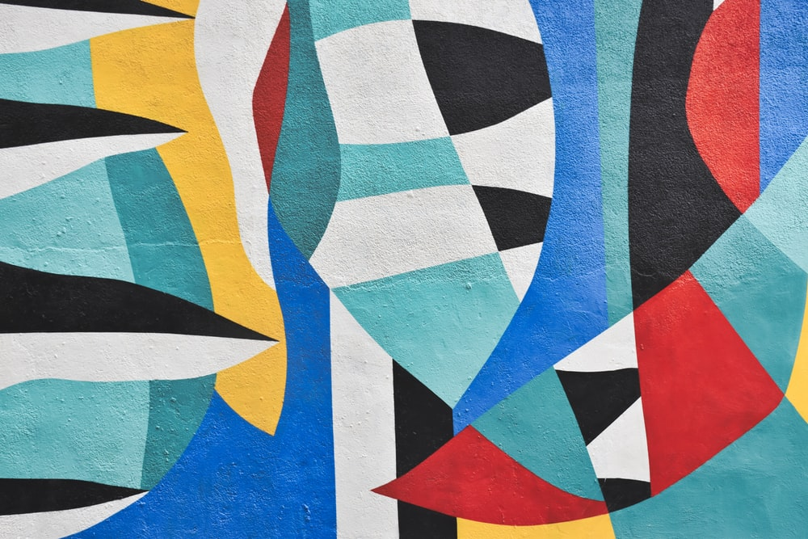
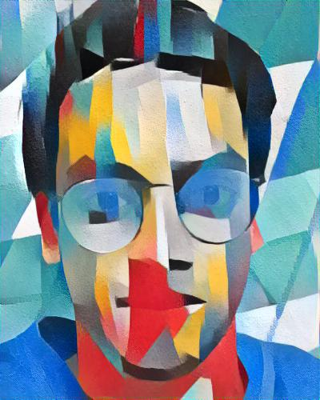
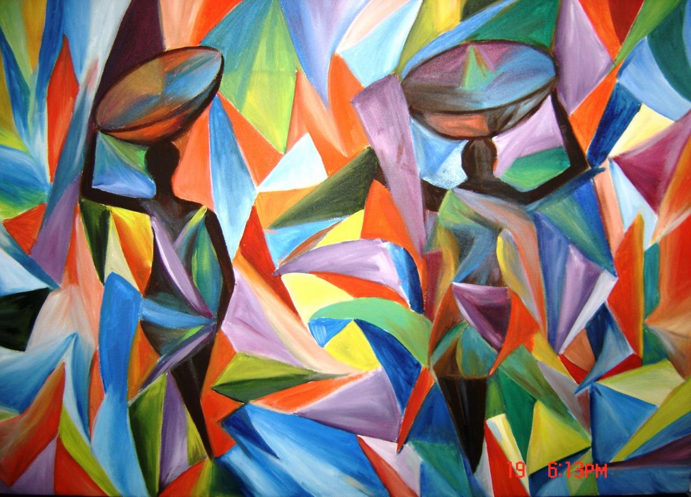
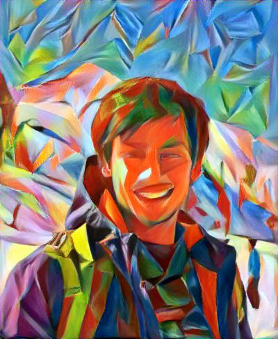

# NeuralStyleTransfer

Content Image                           |  Style Image                   | Result            
:--------------------------------------:|:------------------------------:|:-------------------------:
  |    |  
{width=50}  |    |  

An implementation of neural style in PyTorch.

The class takes in the file path of the content image and the style image form the respective folders and generates the result in the result folder. Few examples have been provided.

I have added support for GPU. Estimated time for 10000 iteration when run on the Google colab GPU is 700 seconds. Feel free to try ne styles and images. I have only run on portraits and have recieved good results.

